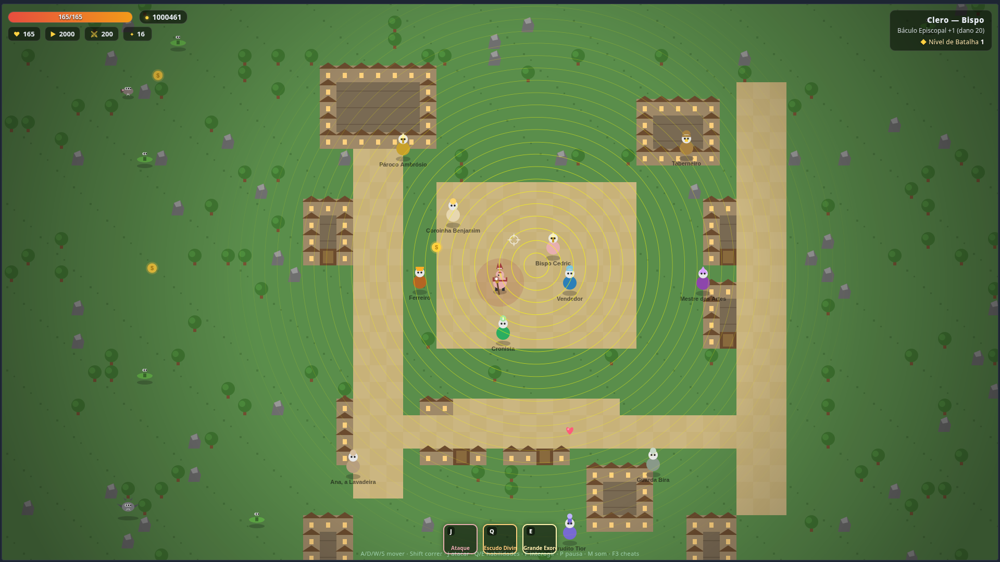

# Eclésia — Protótipo RPG 2D

Protótipo de RPG de ação 2D top-down com progressão de personagem, chefes e mundo semi-aberto. Desenvolvido em HTML5 Canvas, CSS e JavaScript puro.

## Stack

- HTML5
- CSS3
- JavaScript (ES6+)
- Vercel

## Funcionalidades

- **3 castas / 9 subclasses**: Clero (Diácono, Padre, Bispo), Templários (Guerreiro, Arqueiro, Inventor), Mago (Elemental, Psíquico, Abençoador) — cada uma com stats, arma, ataque base e 2 habilidades únicas (Q/E). As subclasses de cada casta seguem uma progressão de poder da mais fraca para a mais forte.
- **Habilidades extras**: até 3 habilidades adicionais compráveis (R/T/Y) no Mestre das Artes.
- **Combate**: corpo a corpo, projéteis, auras e área; sistema de fraquezas/resistências por tipo de dano (Físico, Sagrado, Mágico).
- **Progressão**: ouro para melhorar arma no Ferreiro, comprar poções/tomés no Vendedor, aprender habilidades extras e treinar reflexos (ataque/disparo mais rápidos).
- **Mundo vasto e dinâmico**: mapa de 400×240 tiles (12.800 × 7.680 px) gerado proceduralmente em chunks de 16×16 tiles. Apenas a área próxima ao jogador é carregada/renderizada; chunks distantes são descarregados e recriados ao retornar, preservando dados importantes (chefes derrotados, árvores destruídas, progresso de selos).
- **18 biomas/regiões**: Prado Sereno, Vila de Pedra, Campos de Trigo, Floresta dos Goblins, Bosque dos Lobos, Campo do Norte, Bosque Sagrado, Pântano Sombrio, Ruínas de Aurelia, Cemitério dos Esquecidos, Colinas Rochosas, Templo Ruinoso, Várzea Sul, Catacumbas, Gruta do Execra, Cova do Demônio, Forte do General, Torre Perdida.
- **40 tipos de monstros**: todos usados no mundo — 15 originais + 16 novos por bioma + 4 raros/especiais (Lobisomem, Gigante de Pedra, Sacerdote da Noite, Dragãozinho) + chefes. Cada um com sprite próprio (cores `color`/`dark` definidas nos dados) e recompensas escalonadas pela periculosidade da região.
- **Sistema de spawn melhorado**: monstros nascem em pontos determinísticos por chunk, nunca em cima do jogador (distância mínima 210px), com cooldowns baseados no perigo da região.
- **Estabelecimentos por casta**:
  - **Igreja** (Clero): rezar (cura total grátis), estudar escrituras (+vida máx), liturgia (lore do Clero), Missa/Crisma/Ordenação por grau do clero.
  - **Taverna** (Templários): bebida (cura por ouro), histórias de guerra (lore dos Templários), treino forjado (+força permanente), treino de reflexos (+10% de velocidade de ataque/disparo por nível).
  - **Torre Arcana** (Mago): meditar (cura + reset cooldowns grátis), grimório (lore do Mago), consulta arcana (+inteligência permanente).
- **Sistema de Bênçãos**: 10 bênçãos sagradas aprendidas ao explorar — ensinadas por Padres e Bispos espalhados pelo mundo (igrejas/capelas em biomas variados). Padres ensinam bênçãos comuns/intermediárias (Luz, Misericórdia, Coragem, Escudo da Fé, Passos do Peregrino); Bispos ensinam as raras (Cadência, Precisão, Fúria, Julgamento). Teclas B/G/U/V/N (reutilizando o pipeline de habilidades). Até 6 por partida.
- **O Papa (10% de chance por partida)**: aparição rara num bioma perigoso distante da vila. Ao ser encontrado, ensina a **Bênção Suprema** (tecla H) — o milagre mais poderoso do jogo.
- **Bênção Suprema**: uso único por partida (consumida permanentemente ao usar). Cria uma coluna de luz divina que **aniquila instantaneamente qualquer ser na área do impacto** (raio ~430px), ignorando vida e resistências — inclusive chefes — mas NÃO afeta o mapa inteiro.
- **NPCs e pequenas histórias**: 22 NPCs espalhados com diálogos específicos por casta. Interações exclusivas:
  - **Confissão** (Clero): NPCs revelam segredos; jogador ganha +10 vida máx, +2 int, dano +35% temporário, visual de bênção dourada.
  - **Treino** (Templários): +2 força + dano +25% temporário.
  - **Saber arcano** (Mago): +3 inteligência permanente.
- **Lore progressiva por casta**: 4 capítulos do Clero, 4 dos Templários, 4 do Mago, descobertos naturalmente em igrejas, tavernas, torres, zonas especiais e NPCs.
- **Finais específicos por casta** (cada um com arena, intro, padrões únicos):
  - **Clero**: Mastema, o Demônio (Cova do Demônio) → "Você guiou as almas do Senhor a Ele."
  - **Templários**: General Tarraske (Forte do General) → "O General caiu. A fronteira dos templários está segura."
  - **Mago**: O Arcano Devorador (Torre Perdida) → "O véu tornou a se fechar. O saber prevalece."
- **Final alternativo**: derrotar o chefe de outra casta exibe "Você é bom nisso... já pensou em ser [Padre/Guerreiro/Mago]?" e permite continuar explorando.
- **Progressão por Selos**: 5 selos interativos (Catacumbas, Gruta, Cova do Demônio, Forte, Torre) exigem cristais específicos (Floresta, Sombrio, Final) para abrir.
- **Controle de spawn**: ao derrotar o chefe de uma área, monstros comuns param de spawnar (spawn drasticamente reduzido).
- **NPCs**: Ferreiro, Vendedor, Mestre das Artes, Cronista, Pároco, Taberneiro, Erudito, + NPCs de lore/confissão/treino espalhados pelo mundo.
- **Estatísticas**: tempo, abates, chefes, mortes, dano causado/recebido, combo máximo, power-ups, zonas visitadas.
- **Recordes locais**: salvos no `localStorage` por subclasse; a tela de vitória exibe estatísticas completas (tempo jogado, abates, chefes, mortes, dano, combo, exploração) e marca novos recordes.
- **Consumíveis/armas modernas**: removidos e substituídos pelo sistema de Bênçãos (ver acima).<br>
- **Sistema de cheats** (F3): ouro/vida infinitos, edição de stats, painel visual e `get <bencao_id>` (ex.: `get bencao_suprema` para testar a Bênção Suprema).
- **Efeitos visuais**: partículas, screen shake, flash de dano, barras de vida, anéis de habilidade, texto flutuante, auras de raro/chefes finais.
- **Áudio**: Web Audio API para efeitos (ataque, hit, cura, upgrade, boss, arremesso, etc.).

## Estrutura de dados

### Subclasses
Definidas em `js/data.js` (`SUBCLASSES`). Cada uma contém:
- `casta` (clero/templarios/mago), `hp`, `speed`, `str`, `int`, `jump`
- `weapon`: nome, dano base, cor, tipo (`melee`/`ranged`/`aura`)
- `attack`: tipo, multiplicador, alcance/cadência, cor, propriedades extras (pierce, combo, etc.)
- `aura` (opcional): raio, dano por tick, intervalo
- `skills`: 2 habilidades com tecla, cooldown, descrição e efeitos

### Monstros
Definidos em `js/data.js` (`MONSTERS`). Cada um tem:
- `hp`, `dmg`, `speed`, `behavior` (`hop`, `swoop`, `chase`, `range`, `slowChase`, `wraith`, `boss`)
- `resist` / `weak`: arrays de tipos de dano
- `gold`: range de recompensa
- Propriedades especiais: `fly`, `venom`, `invokes`, `explodeOnDeath`, `boss`, `crystal`, `finalBoss`, `casta`, `rare`, `tier`

### Regiões e Spawns
- `REGIONS`: 18 áreas nomeadas com limites retangulares, `decor` (grass, fields, forest, swamp, ruins, cemetery, rocky, cave, hell, fort, arcane, town), `danger` (1-5), `density`, `priority`, `indoor`, `monsters` (tabela ponderada), `rares`, `boss` fixo.
- `SEALS`: 5 selos interativos substituindo portões estáticos; exigem cristais específicos.
- Spawns dinâmicos por chunk: pontos de spawn determinísticos com validação de solo caminhável, distância mínima do jogador, cooldown por perigo da região.

## Estatísticas / Persistência

- **Estatísticas da run** (`GAME.stats`): zeradas a cada nova partida; incluem tempo, kills, bosses, deaths, dmgDealt, dmgTaken, maxCombo, powerups, exploration.
- **Recordes**: salvos no `localStorage` sob a chave `eclesia_v1`. Estrutura: `{ bestScore, bestTime, maxCombo, bestKills, bestBosses, bestDeaths, bestDmgDealt, bestExploration, wins, lastRun, byClass }`. `lastRun` guarda o snapshot completo da última vitória (classe, data, tempo, abates, chefes, mortes, dano, combo, arma/bênção, power-ups, exploração). Exibidos no menu via botão "Recordes Locais" e na tela de vitória.
- **Progressão importante persistida entre chunks/mortes**: chefes derrotados (`defeatedBosses`), cristais obtidos (`crystals`), selos quebrados (`sealsBroken`), lore descoberto (`loreDiscovered`), NPCs confessados/treinados (`eventDone`).

## Próximos passos

### Concluído
- Sistema de classes, habilidades e combate base
- Mundo vasto procedural com chunks dinâmicos, 18 biomas, town craftada
- NPCs e estabelecimentos por casta com interações exclusivas (confissão, treino, saber)
- 30+ monstros com comportamentos variados, raros com recompensas pesadas, spawn melhorado
- 3 chefs de progressão (Krol, Gere, Titã) + 3 chefes finais por casta (Demônio, General, Arcano) com padrões únicos
- Lore progressiva por casta descoberta naturalmente
- Finais específicos por casta + final alternativo
- Progressão por Selos (cristais) substituindo portões estáticos
- Persistência de recordes no localStorage
- Sistema de cheats para testes (com quantidade dinâmica `xN`)
- Sistema de Bênçãos: 10 bênçãos de poder variado ensinadas por Padres/Bispos no mundo (substitui armas e itens modernos)
- Papa com 10% de chance por partida — ensina a Bênção Suprema (uso único, hitkill em área ao redor do impacto, visual de coluna de luz)
- Treino de reflexos na Taverna (bater/atirar mais rápido, até 2x)
- Tela de vitória completa e recordes locais detalhados (última jornada + recordes por estatística)
- Controle de spawn por região (pára/reduz drasticamente após boss)
- Efeitos visuais, áudio, HUD, menus

### Próximos passos
- Balanceamento de stats, dano e economia (ouro, custos de upgrade)
- Mais variedade de itens consumíveis e equipamentos
- Melhoria na IA de bosses (fases, padrões adicionais)
- Tela de vitória/derrota com estatísticas finais mais completas
- Opção de continuar pós-jogo (New Game+ ou exploração livre)
- Acessibilidade: suporte a toque/mobile, legendas para áudio
- Otimização de renderização para mapas maiores

### Imagens



## Como executar

### Produção (Vercel)
Acesse a versão publicada: https://eclesia-rpg.vercel.app (ou a URL do seu deploy).

### Local
```bash
git clone https://github.com/seu-usuario/my_rpg.git
cd my_rpg
# Sirva os arquivos estáticos (qualquer servidor HTTP)
npx serve .
# ou
python3 -m http.server 8000
# depois abra http://localhost:3000 (serve) ou http://localhost:8000 (python)
```
Não há dependências, build ou instalação — apenas arquivos estáticos.

## Deploy

O projeto está configurado para deploy estático na Vercel. O `vercel.json` (se presente) aponta para a raiz do repositório; o `index.html` carrega `style.css` e os módulos JS em `js/`. Cada push na branch principal gera novo deploy automático.